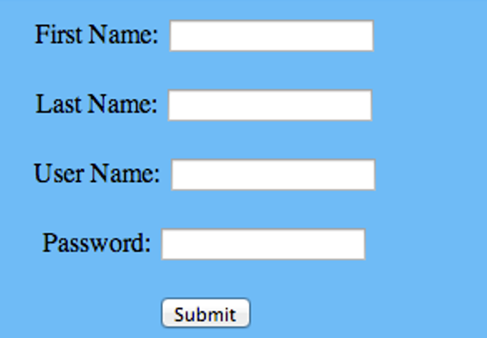

# Login System

### Code

- PHP
- HTML
- CSS
- JQuery
- No HTML 5

### Requirements

- Make a login screen that asks a user for his username and password. if he isn’t a user yet, provide a form they can fill out in which it asks for their first name, last name, birthday, username and password.
- When they fill out the new user form, store their info in the database
- Once they have filled out the new user form, let them go back to the login page and allow them to login once they’ve put in their username and password.
- Check the entered username and password against the username and password in the database and if it’s correct, take them to a page that displays their info.

## Login System (Optional)

### Code

- PHP
- HTML
- CSS
- JQuery
- No HTML 5

### Requirements Create a page that they go to once they’ve logged in.

- On that page have a way they can upload photos.
- Once they’ve uploaded the photos, move the photo they upload to your folder and store their location in the databases
- Then display the photos they’ve uploaded. Show 4 at a time with next and previous buttons
